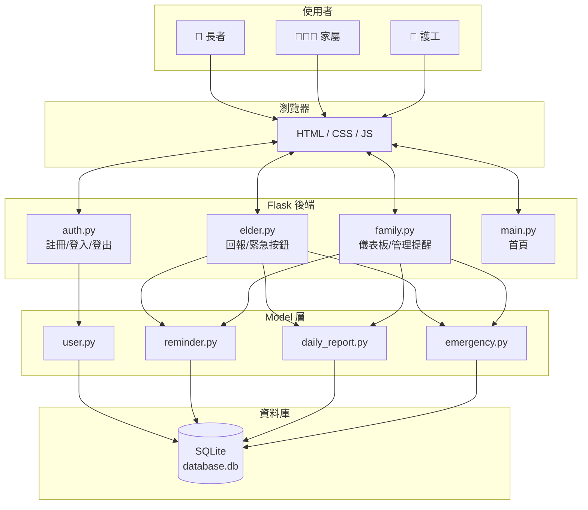

# 獨居老人生活管家 — 系統架構設計

> **對應文件**：[PRD](./PRD.md)  
> **版本**：v1.0  
> **最後更新**：2026-05-19

---

## 1. 技術架構說明

### 1.1 技術選型

| 層面 | 技術 | 說明 |
| :--- | :--- | :--- |
| 後端框架 | Python + Flask | 輕量級 Web 框架，適合快速開發，課堂指定 |
| 模板引擎 | Jinja2 | Flask 內建，負責 HTML 頁面渲染 |
| 資料庫 | SQLite | 輕量單檔資料庫，無需額外安裝，適合小型專案 |
| 前端 | HTML / CSS / JavaScript | 純前端技術，無框架依賴 |
| CSS 框架 | Bootstrap 5 (CDN) | 提供響應式佈局與基礎元件，加速前端開發 |
| 密碼雜湊 | Werkzeug (generate_password_hash) | Flask 內建的安全密碼處理工具 |

### 1.2 MVC 架構模式

本專案採用 **MVC（Model-View-Controller）** 架構：

```
┌──────────────────────────────────────────────────────┐
│                     使用者瀏覽器                       │
│            (HTML / CSS / JavaScript)                  │
└────────────┬─────────────────────┬────────────────────┘
             │ HTTP Request        │ HTTP Response (HTML)
             ▼                     │
┌──────────────────────────────────┴────────────────────┐
│              Controller（Flask Routes）                │
│              app/routes/*.py                          │
│  - 接收使用者請求                                      │
│  - 呼叫 Model 處理資料                                 │
│  - 選擇 View（模板）回傳                               │
└────────────┬─────────────────────┬────────────────────┘
             │                     │
     ┌───────▼───────┐     ┌──────▼───────┐
     │     Model     │     │     View     │
     │ app/models/   │     │ app/templates│
     │  *.py         │     │  *.html      │
     │               │     │              │
     │ - 資料庫操作   │     │ - Jinja2 模板│
     │ - CRUD 方法   │     │ - 頁面呈現   │
     │ - 商業邏輯    │     │ - 表單介面   │
     └───────┬───────┘     └──────────────┘
             │
             ▼
     ┌───────────────┐
     │    SQLite      │
     │ instance/      │
     │ database.db    │
     └───────────────┘
```

- **Model**（`app/models/`）：負責資料庫操作與商業邏輯，每個資料表對應一個 Python 檔案。
- **View**（`app/templates/`）：Jinja2 HTML 模板，負責頁面呈現與使用者互動介面。
- **Controller**（`app/routes/`）：Flask 路由，負責接收 HTTP 請求、呼叫 Model、選擇模板回傳。
# 系統架構設計 (Architecture)：獨居老人生活管家系統

## 1. 技術架構說明

### 選用技術與原因
- **後端框架**：Python + Flask
  - **原因**：Flask 是輕量級框架，適合中小型專案快速開發，具有高度彈性。
- **前端模板引擎**：Jinja2
  - **原因**：搭配 Flask 可以直接在後端渲染 HTML，降低系統複雜度，不需要維護前後端分離的架構。
- **資料庫**：SQLite
  - **原因**：無伺服器架構的資料庫，設定簡單且易於備份，非常適合本專案的輕量級需求。
- **前端樣式**：原生 CSS / 輕量級 CSS 框架
  - **原因**：為了達成高對比度、大按鈕等針對長者優化的 UI，使用簡單的 CSS 可精準控制畫面呈現。

### Flask MVC 模式說明
本專案採用類似 MVC (Model-View-Controller) 的架構來分離關注點：
- **Model (模型)**：負責與 SQLite 資料庫溝通，定義資料表結構（例如：使用者資料、回報紀錄、提醒事項），處理資料的新增、讀取、更新、刪除 (CRUD)。
- **View (視圖)**：由 Jinja2 模板與 CSS 負責。將 Controller 傳遞過來的資料渲染成瀏覽器可見的 HTML 畫面，例如長者看到的「緊急求助」大按鈕畫面。
- **Controller (控制器)**：由 Flask 的路由 (`routes`) 負責。接收來自瀏覽器的 HTTP 請求（例如點擊回報按鈕），呼叫對應的 Model 更新資料，並選擇適當的 View 回傳給瀏覽器。

---

## 2. 專案資料夾結構

```
Handsome-guy/
├── app.py                     ← Flask 應用程式入口點
├── requirements.txt           ← Python 套件依賴清單
├── .env.example               ← 環境變數範例
├── .gitignore                 ← Git 忽略規則
│
├── app/                       ← 主要應用程式資料夾
│   ├── __init__.py            ← App 初始化（Flask app factory）
│   │
│   ├── models/                ← 資料庫模型（Model 層）
│   │   ├── __init__.py
│   │   ├── user.py            ← 使用者模型（註冊/登入/角色管理）
│   │   ├── reminder.py        ← 事項提醒模型
│   │   ├── daily_report.py    ← 每日回報模型
│   │   └── emergency.py       ← 緊急通報模型
│   │
│   ├── routes/                ← Flask 路由（Controller 層）
│   │   ├── __init__.py
│   │   ├── auth.py            ← 認證路由（註冊/登入/登出）
│   │   ├── elder.py           ← 長者功能路由（回報/緊急按鈕/查看提醒）
│   │   ├── family.py          ← 家屬功能路由（儀表板/管理提醒/查看紀錄）
│   │   └── main.py            ← 通用路由（首頁/關於）
│   │
│   ├── templates/             ← Jinja2 HTML 模板（View 層）
│   │   ├── base.html          ← 基礎模板（導覽列 + 共用結構）
│   │   ├── index.html         ← 首頁
│   │   │
│   │   ├── auth/              ← 認證相關頁面
│   │   │   ├── login.html     ← 登入頁
│   │   │   └── register.html  ← 註冊頁
│   │   │
│   │   ├── elder/             ← 長者功能頁面
│   │   │   ├── dashboard.html ← 長者主頁（大按鈕介面）
│   │   │   ├── reminders.html ← 長者查看提醒
│   │   │   └── report.html    ← 每日回報頁面
│   │   │
│   │   └── family/            ← 家屬功能頁面
│   │       ├── dashboard.html ← 家屬儀表板
│   │       ├── reminders.html ← 管理提醒事項
│   │       ├── reminder_form.html ← 新增/編輯提醒表單
│   │       ├── reports.html   ← 查看回報紀錄
│   │       └── emergencies.html ← 查看緊急通報紀錄
│   │
│   └── static/                ← 靜態資源
│       ├── css/
│       │   └── style.css      ← 自訂樣式
│       └── js/
│           └── main.js        ← 自訂 JavaScript
│
├── database/                  ← 資料庫相關
│   └── schema.sql             ← SQL 建表語法
│
├── instance/                  ← Flask 實例資料夾（不納入版控）
│   └── database.db            ← SQLite 資料庫檔案
│
└── docs/                      ← 設計文件
    ├── PRD.md                 ← 產品需求文件
    ├── ARCHITECTURE.md        ← 系統架構文件（本文件）
    ├── FLOWCHART.md           ← 流程圖
    ├── DB_DESIGN.md           ← 資料庫設計
    └── ROUTES.md              ← 路由設計
```

### 各資料夾說明

| 路徑 | 用途 |
| :--- | :--- |
| `app.py` | 應用程式入口，引入 Flask app 並啟動伺服器 |
| `app/__init__.py` | Flask app factory，初始化 app、註冊 Blueprint、設定 secret key |
| `app/models/` | 每個檔案對應一張資料表，提供 CRUD 方法 |
| `app/routes/` | 每個檔案是一個 Flask Blueprint，負責處理 HTTP 請求 |
| `app/templates/` | Jinja2 模板，所有頁面都繼承 `base.html` |
| `app/static/` | CSS、JavaScript 等靜態檔案 |
| `database/schema.sql` | 完整的 SQL 建表語法，用於初始化資料庫 |
| `instance/` | SQLite 資料庫實際檔案存放處 |

以下為本專案的建議資料夾結構：

```text
Handsome-guy/
├── app/                      # 應用程式主要程式碼
│   ├── __init__.py           # Flask App 初始化設定
│   ├── models/               # 資料庫模型 (Model)
│   │   ├── __init__.py
│   │   ├── user.py           # 使用者與綁定關係模型
│   │   ├── status.py         # 每日回報紀錄模型
│   │   └── reminder.py       # 事項提醒模型
│   ├── routes/               # 路由與業務邏輯 (Controller)
│   │   ├── __init__.py
│   │   ├── auth.py           # 註冊與登入路由
│   │   ├── elder.py          # 長者端操作路由 (打卡、SOS)
│   │   └── family.py         # 家屬/護工端操作路由 (設定提醒、查看狀態)
│   ├── templates/            # Jinja2 HTML 模板 (View)
│   │   ├── base.html         # 共用模板與版面配置
│   │   ├── elder/            # 長者專用畫面 (大字體、極簡)
│   │   │   └── dashboard.html
│   │   └── family/           # 家屬/護工作業畫面
│   │       └── dashboard.html
│   └── static/               # 靜態資源檔案
│       ├── css/
│       │   └── style.css     # 全域樣式設定
│       ├── js/
│       │   └── main.js       # 前端互動邏輯
│       └── images/           # 圖片與圖示
├── instance/                 # 本地環境配置與資料庫 (不進版控)
│   └── database.db           # SQLite 資料庫檔案
├── docs/                     # 專案文件
│   ├── PRD.md                # 產品需求文件
│   └── ARCHITECTURE.md       # 系統架構設計文件 (本文件)
├── requirements.txt          # Python 依賴套件清單
└── app.py                    # 專案啟動入口檔案
```

---

## 3. 元件關係圖



### 請求處理流程

```mermaid
sequenceDiagram
    actor User as 使用者
    participant Browser as 瀏覽器
    participant Route as Flask Route
    participant Model as Model
    participant DB as SQLite

    User->>Browser: 點擊按鈕/送出表單
    Browser->>Route: HTTP Request (GET/POST)
    Route->>Model: 呼叫 CRUD 方法
    Model->>DB: SQL 查詢/寫入
    DB-->>Model: 查詢結果
    Model-->>Route: 回傳資料
    Route->>Route: 選擇 Jinja2 模板
    Route-->>Browser: 渲染後的 HTML
    Browser-->>User: 顯示頁面
以下展示使用者透過瀏覽器操作時，系統內部的資料流動與元件互動關係：

```mermaid
sequenceDiagram
    participant Browser as 瀏覽器 (長者/家屬)
    participant Route as Flask Route (Controller)
    participant Model as Database Model (Model)
    participant DB as SQLite 資料庫
    participant Template as Jinja2 Template (View)

    Browser->>Route: 1. 發送 HTTP 請求 (例如：按下回報按鈕)
    Route->>Model: 2. 呼叫邏輯處理與資料存取
    Model->>DB: 3. 讀寫資料 (INSERT INTO status)
    DB-->>Model: 4. 回傳執行結果
    Model-->>Route: 5. 回傳資料物件
    Route->>Template: 6. 將資料傳入模板進行渲染
    Template-->>Route: 7. 產生完整的 HTML
    Route-->>Browser: 8. 回傳 HTML 頁面給使用者呈現
```

---

## 4. 關鍵設計決策

### 決策 1：角色分流的介面設計

**決定**：長者和家屬/護工使用**不同的介面與路由**，而非統一介面。

**原因**：
- 長者介面需要極度簡化（大按鈕、大字體、最少操作步驟）
- 家屬/護工需要資訊豐富的儀表板
- 兩種需求差異太大，統一設計反而降低體驗

### 決策 2：使用 Flask Blueprint 組織路由

**決定**：以使用者角色為單位拆分 Blueprint（auth / elder / family / main）。

**原因**：
- 方便團隊分工，每個人負責不同模組
- 路由邏輯不會混在一起，易於維護
- 日後擴充新角色功能時不影響現有模組

### 決策 3：使用原生 sqlite3 而非 SQLAlchemy

**決定**：直接使用 Python 內建的 `sqlite3` 模組操作資料庫。

**原因**：
- 團隊成員對 SQL 語法較熟悉
- 減少學習成本，不需額外學習 ORM
- 專案規模小，ORM 的優勢不明顯

### 決策 4：不使用前後端分離

**決定**：頁面由 Flask + Jinja2 直接渲染，不使用 API + 前端框架。

**原因**：
- 課堂規定使用 Flask + Jinja2
- 團隊規模與時程適合 Server-Side Rendering
- 降低複雜度，專注在功能實作

### 決策 5：密碼安全使用 Werkzeug

**決定**：使用 Flask 內建的 `werkzeug.security` 模組的 `generate_password_hash` / `check_password_hash` 處理密碼。

**原因**：
- 不需額外安裝套件
- 預設使用 PBKDF2 演算法，安全性足夠
- 使用簡單，適合教學專案

---

*下一步：請執行 Flowchart Skill 產出流程圖文件。*
1. **採用伺服器端渲染 (SSR)**
   - **原因**：我們選擇不使用前端框架進行前後端分離，而是透過 Flask + Jinja2 直接在伺服器端產出 HTML。這樣能大幅降低初期開發與部署的複雜度，對於只需要簡單互動的長者端介面尤為適合。

2. **區分「長者」與「家屬/護工」雙重介面目錄**
   - **原因**：目標用戶的數位能力差異極大。長者端需要極簡、大字體、高對比的介面；而家屬端需要資訊密集的儀表板來查看紀錄與設定提醒。因此在路由 (`routes`) 與模板 (`templates`) 進行了實體隔離，確保設計互不干擾。

3. **使用 SQLite 作為資料庫**
   - **原因**：為了符合系統長期穩定運行但初期資料量不大的特性，SQLite 不需要額外架設資料庫伺服器，單一檔案即可運作，降低了維護成本。

4. **緊急通知機制的擴充性設計**
   - **原因**：目前的架構允許在 `elder.py` 的路由中，輕易加入第三方 API (例如 LINE Notify 或 Email) 的發送邏輯。當長者按下 SOS 時，除了寫入資料庫，也能即時觸發外部通知機制。
