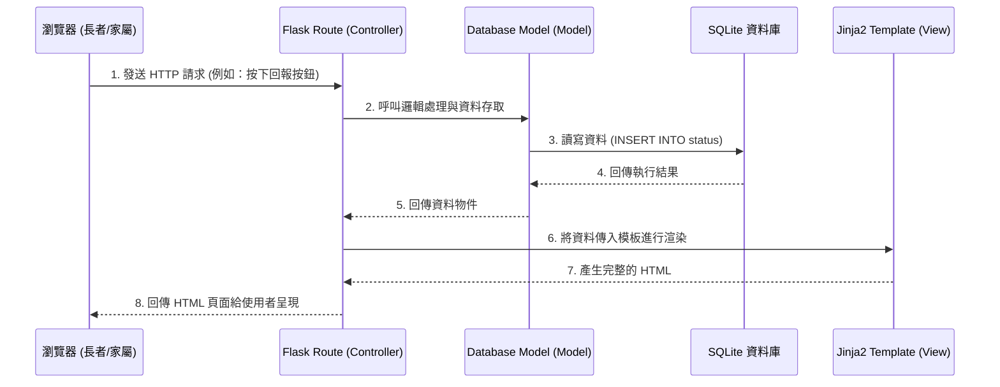

# 系統架構設計 (Architecture)：獨居老人生活管家系統

## 1. 技術架構說明

### 選用技術與原因
- **後端框架**：Python + Flask
  - **原因**：Flask 是輕量級框架，適合中小型專案快速開發，具有高度彈性。
- **前端模板引擎**：Jinja2
  - **原因**：搭配 Flask 可以直接在後端渲染 HTML，降低系統複雜度，不需要維護前後端分離的架構。
- **資料庫**：SQLite
  - **原因**：無伺服器架構的資料庫，設定簡單且易於備份，非常適合本專案的輕量級需求。
- **前端樣式**：原生 CSS / 輕量級 CSS 框架
  - **原因**：為了達成高對比度、大按鈕等針對長者優化的 UI，使用簡單的 CSS 可精準控制畫面呈現。

### Flask MVC 模式說明
本專案採用類似 MVC (Model-View-Controller) 的架構來分離關注點：
- **Model (模型)**：負責與 SQLite 資料庫溝通，定義資料表結構（例如：使用者資料、回報紀錄、提醒事項），處理資料的新增、讀取、更新、刪除 (CRUD)。
- **View (視圖)**：由 Jinja2 模板與 CSS 負責。將 Controller 傳遞過來的資料渲染成瀏覽器可見的 HTML 畫面，例如長者看到的「緊急求助」大按鈕畫面。
- **Controller (控制器)**：由 Flask 的路由 (`routes`) 負責。接收來自瀏覽器的 HTTP 請求（例如點擊回報按鈕），呼叫對應的 Model 更新資料，並選擇適當的 View 回傳給瀏覽器。

---

## 2. 專案資料夾結構

以下為本專案的建議資料夾結構：

```text
Handsome-guy/
├── app/                      # 應用程式主要程式碼
│   ├── __init__.py           # Flask App 初始化設定
│   ├── models/               # 資料庫模型 (Model)
│   │   ├── __init__.py
│   │   ├── user.py           # 使用者與綁定關係模型
│   │   ├── status.py         # 每日回報紀錄模型
│   │   └── reminder.py       # 事項提醒模型
│   ├── routes/               # 路由與業務邏輯 (Controller)
│   │   ├── __init__.py
│   │   ├── auth.py           # 註冊與登入路由
│   │   ├── elder.py          # 長者端操作路由 (打卡、SOS)
│   │   └── family.py         # 家屬/護工端操作路由 (設定提醒、查看狀態)
│   ├── templates/            # Jinja2 HTML 模板 (View)
│   │   ├── base.html         # 共用模板與版面配置
│   │   ├── elder/            # 長者專用畫面 (大字體、極簡)
│   │   │   └── dashboard.html
│   │   └── family/           # 家屬/護工作業畫面
│   │       └── dashboard.html
│   └── static/               # 靜態資源檔案
│       ├── css/
│       │   └── style.css     # 全域樣式設定
│       ├── js/
│       │   └── main.js       # 前端互動邏輯
│       └── images/           # 圖片與圖示
├── instance/                 # 本地環境配置與資料庫 (不進版控)
│   └── database.db           # SQLite 資料庫檔案
├── docs/                     # 專案文件
│   ├── PRD.md                # 產品需求文件
│   └── ARCHITECTURE.md       # 系統架構設計文件 (本文件)
├── requirements.txt          # Python 依賴套件清單
└── app.py                    # 專案啟動入口檔案
```

---

## 3. 元件關係圖

以下展示使用者透過瀏覽器操作時，系統內部的資料流動與元件互動關係：



---

## 4. 關鍵設計決策

1. **採用伺服器端渲染 (SSR)**
   - **原因**：我們選擇不使用前端框架進行前後端分離，而是透過 Flask + Jinja2 直接在伺服器端產出 HTML。這樣能大幅降低初期開發與部署的複雜度，對於只需要簡單互動的長者端介面尤為適合。

2. **區分「長者」與「家屬/護工」雙重介面目錄**
   - **原因**：目標用戶的數位能力差異極大。長者端需要極簡、大字體、高對比的介面；而家屬端需要資訊密集的儀表板來查看紀錄與設定提醒。因此在路由 (`routes`) 與模板 (`templates`) 進行了實體隔離，確保設計互不干擾。

3. **使用 SQLite 作為資料庫**
   - **原因**：為了符合系統長期穩定運行但初期資料量不大的特性，SQLite 不需要額外架設資料庫伺服器，單一檔案即可運作，降低了維護成本。

4. **緊急通知機制的擴充性設計**
   - **原因**：目前的架構允許在 `elder.py` 的路由中，輕易加入第三方 API (例如 LINE Notify 或 Email) 的發送邏輯。當長者按下 SOS 時，除了寫入資料庫，也能即時觸發外部通知機制。
