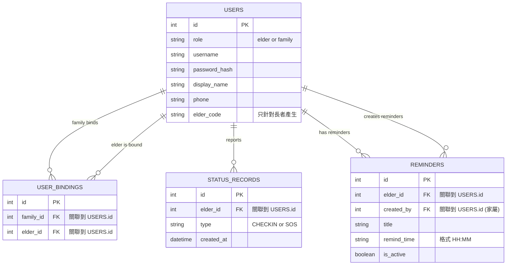

# 資料庫設計文件 (DB Design)：獨居老人生活管家系統

## 1. 實體關係圖 (ER Diagram)

---

## 2. 資料表詳細說明

### 2.1 `users` (使用者表)
儲存所有系統使用者，透過 `role` 區分長者與家屬/護工。
- `id`: INTEGER PK, 自動遞增。
- `role`: TEXT, 必填。限定值為 'elder' 或 'family'。
- `username`: TEXT, 必填。登入用的帳號，需唯一。
- `password_hash`: TEXT, 必填。密碼的雜湊值。
- `display_name`: TEXT, 必填。顯示名稱（例如「王爺爺」或「王大明」）。
- `phone`: TEXT, 聯絡電話，SOS 通報時使用。
- `elder_code`: TEXT, 長者專屬的 6 位數邀請碼，家屬憑此碼綁定。

### 2.2 `user_bindings` (綁定關係表)
處理家屬/護工與長者之間的多對多關係（一個長者可以有多個家屬關心，一個家屬也可以關心多個長者）。
- `id`: INTEGER PK, 自動遞增。
- `family_id`: INTEGER FK, 必填。對應到 `users.id` (role='family')。
- `elder_id`: INTEGER FK, 必填。對應到 `users.id` (role='elder')。

### 2.3 `status_records` (狀態紀錄表)
記錄長者的平安打卡與緊急求助。
- `id`: INTEGER PK, 自動遞增。
- `elder_id`: INTEGER FK, 必填。發出狀態的長者 ID。
- `type`: TEXT, 必填。'CHECKIN' (平安打卡) 或 'SOS' (緊急求助)。
- `created_at`: DATETIME, 必填。預設為當下時間。

### 2.4 `reminders` (提醒事項表)
儲存由家屬設定、發送給長者的日常提醒。
- `id`: INTEGER PK, 自動遞增。
- `elder_id`: INTEGER FK, 必填。接收提醒的長者 ID。
- `created_by`: INTEGER FK, 必填。建立此提醒的家屬 ID。
- `title`: TEXT, 必填。提醒內容，如「吃降血壓藥」。
- `remind_time`: TEXT, 必填。時間格式為 'HH:MM'。
- `is_active`: INTEGER, 必填。1 表示啟用，0 表示停用。

---

## 3. SQL 建表語法
請參考 `database/schema.sql`，包含上述資料表的完整 CREATE TABLE 語法。

## 4. Python Model
請參考 `app/models/` 目錄下的各個 Python 檔案，包含連線設定 (`db.py`) 與各資料表的 CRUD 操作。
