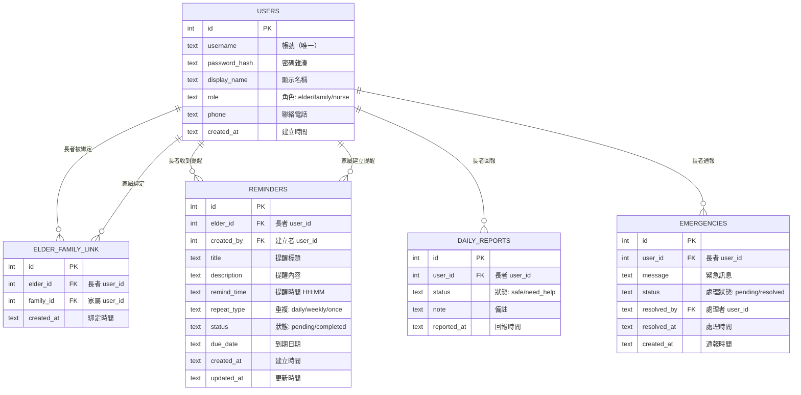

# 獨居老人生活管家 — 資料庫設計

> **對應文件**：[PRD](./PRD.md) / [Flowchart](./FLOWCHART.md)  
> **版本**：v1.0  
> **最後更新**：2026-05-19

---

## 1. ER 圖（實體關係圖）



---

## 2. 資料表詳細說明

### 2.1 USERS（使用者）

管理系統所有使用者的帳號資訊與角色。

| 欄位 | 型別 | 必填 | 說明 |
| :--- | :--- | :--- | :--- |
| `id` | INTEGER | ✅ | 主鍵，自動遞增 |
| `username` | TEXT | ✅ | 帳號，唯一值 |
| `password_hash` | TEXT | ✅ | 密碼雜湊值（Werkzeug） |
| `display_name` | TEXT | ✅ | 顯示名稱（方便辨識） |
| `role` | TEXT | ✅ | 角色：`elder`（長者）/ `family`（家屬）/ `nurse`（護工） |
| `phone` | TEXT | ❌ | 聯絡電話 |
| `created_at` | TEXT | ✅ | 帳號建立時間（ISO 格式） |

**Primary Key**: `id`  
**Unique**: `username`

### 2.2 ELDER_FAMILY_LINK（長者-家屬綁定）

記錄長者與家屬/護工之間的照護關係。

| 欄位 | 型別 | 必填 | 說明 |
| :--- | :--- | :--- | :--- |
| `id` | INTEGER | ✅ | 主鍵，自動遞增 |
| `elder_id` | INTEGER | ✅ | 長者的 user_id（FK → users.id） |
| `family_id` | INTEGER | ✅ | 家屬/護工的 user_id（FK → users.id） |
| `created_at` | TEXT | ✅ | 綁定時間 |

**Primary Key**: `id`  
**Foreign Key**: `elder_id` → `users.id`, `family_id` → `users.id`  
**Unique**: (`elder_id`, `family_id`) 組合唯一

### 2.3 REMINDERS（事項提醒）

儲存家屬為長者建立的提醒事項。

| 欄位 | 型別 | 必填 | 說明 |
| :--- | :--- | :--- | :--- |
| `id` | INTEGER | ✅ | 主鍵，自動遞增 |
| `elder_id` | INTEGER | ✅ | 長者的 user_id（FK → users.id） |
| `created_by` | INTEGER | ✅ | 建立者的 user_id（FK → users.id） |
| `title` | TEXT | ✅ | 提醒標題（如「吃降血壓藥」） |
| `description` | TEXT | ❌ | 提醒詳細內容 |
| `remind_time` | TEXT | ✅ | 提醒時間（格式：HH:MM） |
| `repeat_type` | TEXT | ✅ | 重複類型：`daily`（每天）/ `weekly`（每週）/ `once`（單次） |
| `status` | TEXT | ✅ | 狀態：`pending`（待完成）/ `completed`（已完成） |
| `due_date` | TEXT | ❌ | 到期日期（單次提醒用） |
| `created_at` | TEXT | ✅ | 建立時間 |
| `updated_at` | TEXT | ✅ | 最後更新時間 |

**Primary Key**: `id`  
**Foreign Key**: `elder_id` → `users.id`, `created_by` → `users.id`

### 2.4 DAILY_REPORTS（每日回報）

紀錄長者每天的生活回報。

| 欄位 | 型別 | 必填 | 說明 |
| :--- | :--- | :--- | :--- |
| `id` | INTEGER | ✅ | 主鍵，自動遞增 |
| `user_id` | INTEGER | ✅ | 長者的 user_id（FK → users.id） |
| `status` | TEXT | ✅ | 回報狀態：`safe`（安好）/ `need_help`（需要協助） |
| `note` | TEXT | ❌ | 備註說明 |
| `reported_at` | TEXT | ✅ | 回報時間（ISO 格式） |

**Primary Key**: `id`  
**Foreign Key**: `user_id` → `users.id`

### 2.5 EMERGENCIES（緊急通報）

紀錄長者的緊急求助事件。

| 欄位 | 型別 | 必填 | 說明 |
| :--- | :--- | :--- | :--- |
| `id` | INTEGER | ✅ | 主鍵，自動遞增 |
| `user_id` | INTEGER | ✅ | 長者的 user_id（FK → users.id） |
| `message` | TEXT | ❌ | 緊急訊息描述 |
| `status` | TEXT | ✅ | 處理狀態：`pending`（待處理）/ `resolved`（已處理） |
| `resolved_by` | INTEGER | ❌ | 處理者的 user_id（FK → users.id） |
| `resolved_at` | TEXT | ❌ | 處理時間 |
| `created_at` | TEXT | ✅ | 通報時間 |

**Primary Key**: `id`  
**Foreign Key**: `user_id` → `users.id`, `resolved_by` → `users.id`

---

## 3. SQL 建表語法

以下語法將儲存於 `database/schema.sql`：

```sql
-- 獨居老人生活管家 資料庫 Schema
-- SQLite 語法

-- 使用者資料表
CREATE TABLE IF NOT EXISTS users (
    id INTEGER PRIMARY KEY AUTOINCREMENT,
    username TEXT NOT NULL UNIQUE,
    password_hash TEXT NOT NULL,
    display_name TEXT NOT NULL,
    role TEXT NOT NULL CHECK(role IN ('elder', 'family', 'nurse')),
    phone TEXT,
    created_at TEXT NOT NULL DEFAULT (datetime('now', 'localtime'))
);

-- 長者-家屬綁定資料表
CREATE TABLE IF NOT EXISTS elder_family_link (
    id INTEGER PRIMARY KEY AUTOINCREMENT,
    elder_id INTEGER NOT NULL,
    family_id INTEGER NOT NULL,
    created_at TEXT NOT NULL DEFAULT (datetime('now', 'localtime')),
    FOREIGN KEY (elder_id) REFERENCES users(id) ON DELETE CASCADE,
    FOREIGN KEY (family_id) REFERENCES users(id) ON DELETE CASCADE,
    UNIQUE(elder_id, family_id)
);

-- 事項提醒資料表
CREATE TABLE IF NOT EXISTS reminders (
    id INTEGER PRIMARY KEY AUTOINCREMENT,
    elder_id INTEGER NOT NULL,
    created_by INTEGER NOT NULL,
    title TEXT NOT NULL,
    description TEXT,
    remind_time TEXT NOT NULL,
    repeat_type TEXT NOT NULL DEFAULT 'daily' CHECK(repeat_type IN ('daily', 'weekly', 'once')),
    status TEXT NOT NULL DEFAULT 'pending' CHECK(status IN ('pending', 'completed')),
    due_date TEXT,
    created_at TEXT NOT NULL DEFAULT (datetime('now', 'localtime')),
    updated_at TEXT NOT NULL DEFAULT (datetime('now', 'localtime')),
    FOREIGN KEY (elder_id) REFERENCES users(id) ON DELETE CASCADE,
    FOREIGN KEY (created_by) REFERENCES users(id) ON DELETE CASCADE
);

-- 每日回報資料表
CREATE TABLE IF NOT EXISTS daily_reports (
    id INTEGER PRIMARY KEY AUTOINCREMENT,
    user_id INTEGER NOT NULL,
    status TEXT NOT NULL DEFAULT 'safe' CHECK(status IN ('safe', 'need_help')),
    note TEXT,
    reported_at TEXT NOT NULL DEFAULT (datetime('now', 'localtime')),
    FOREIGN KEY (user_id) REFERENCES users(id) ON DELETE CASCADE
);

-- 緊急通報資料表
CREATE TABLE IF NOT EXISTS emergencies (
    id INTEGER PRIMARY KEY AUTOINCREMENT,
    user_id INTEGER NOT NULL,
    message TEXT,
    status TEXT NOT NULL DEFAULT 'pending' CHECK(status IN ('pending', 'resolved')),
    resolved_by INTEGER,
    resolved_at TEXT,
    created_at TEXT NOT NULL DEFAULT (datetime('now', 'localtime')),
    FOREIGN KEY (user_id) REFERENCES users(id) ON DELETE CASCADE,
    FOREIGN KEY (resolved_by) REFERENCES users(id)
);
```

---

## 4. Python Model 程式碼

Model 檔案將建立在 `app/models/` 資料夾中，每個檔案對應一張資料表，提供以下 CRUD 方法：

| 方法 | 說明 |
| :--- | :--- |
| `create(data)` | 新增一筆記錄 |
| `get_all()` | 取得所有記錄 |
| `get_by_id(id)` | 取得單筆記錄 |
| `update(id, data)` | 更新記錄 |
| `delete(id)` | 刪除記錄 |

> Model 的實際程式碼將在 Implementation 階段實作。

---

*下一步：請執行 API Design Skill 產出路由設計文件。*
