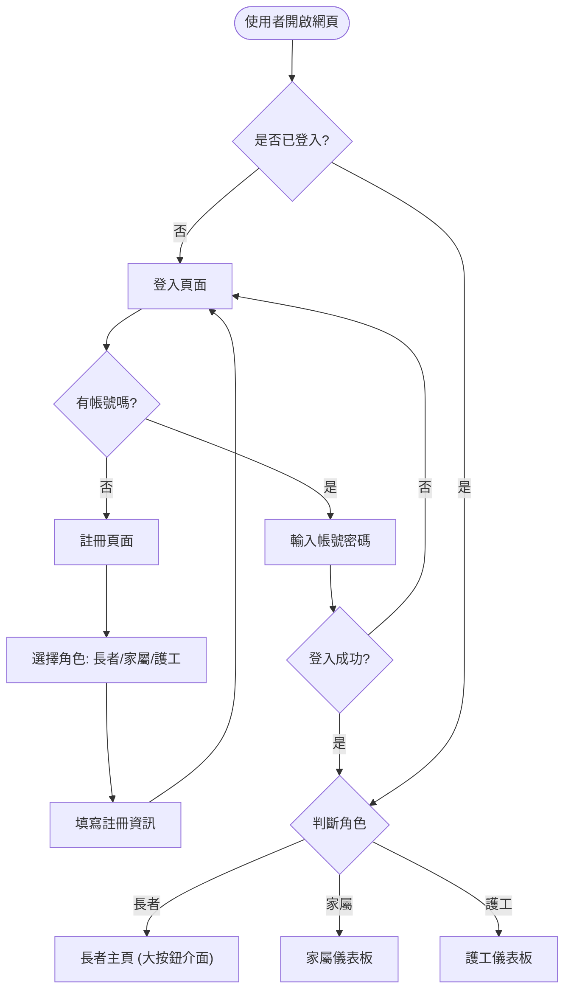
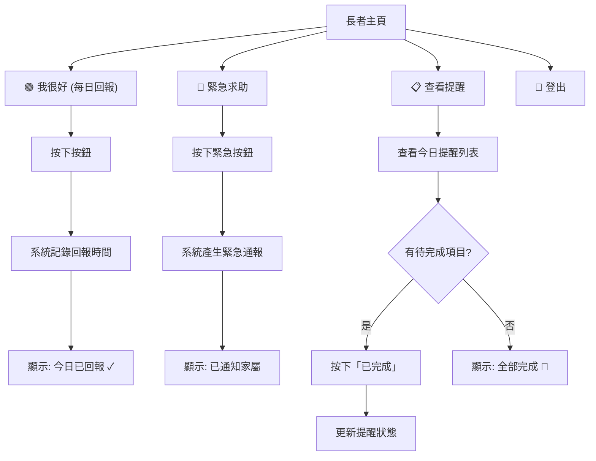
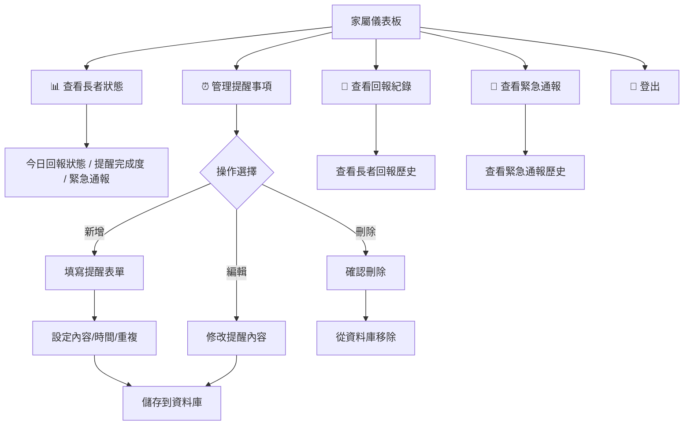
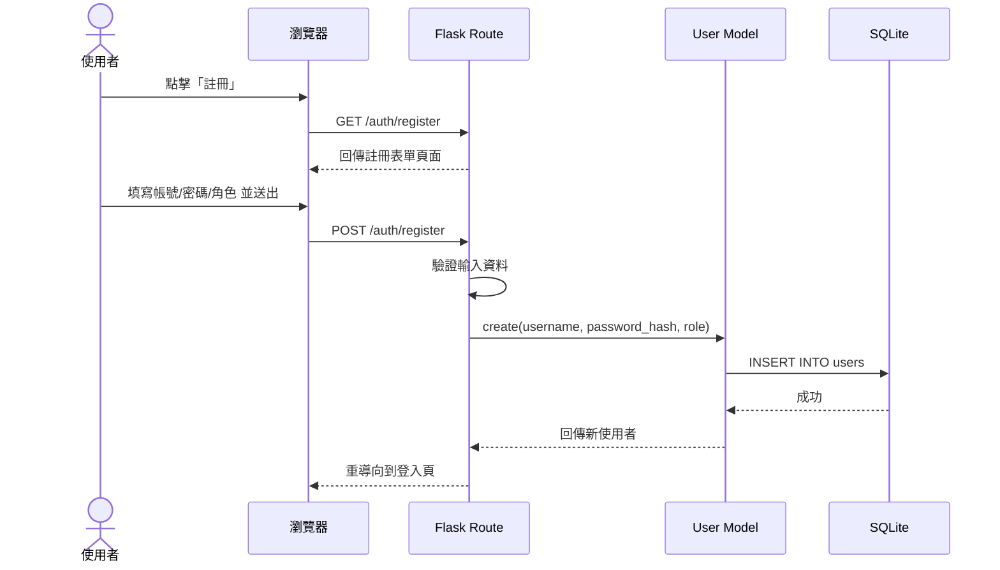
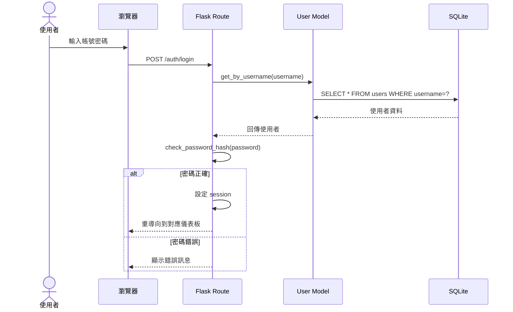
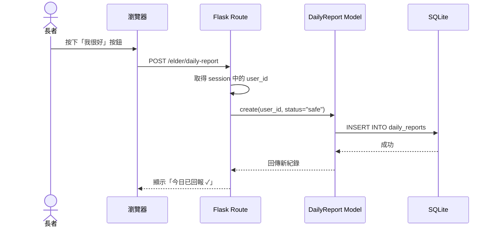
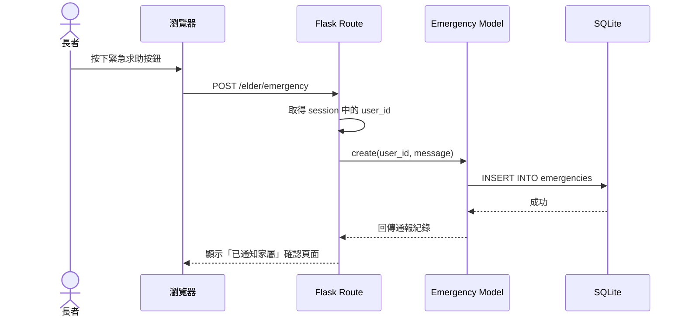
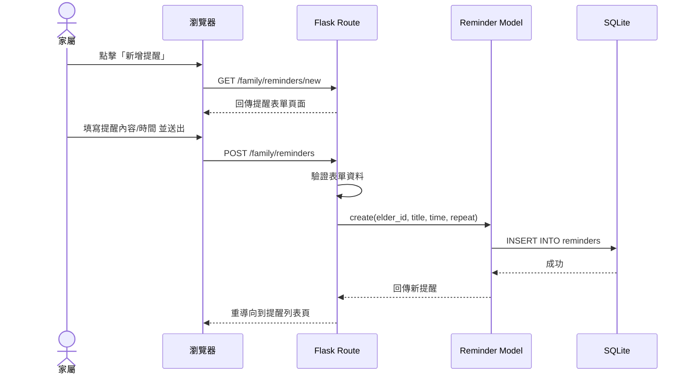
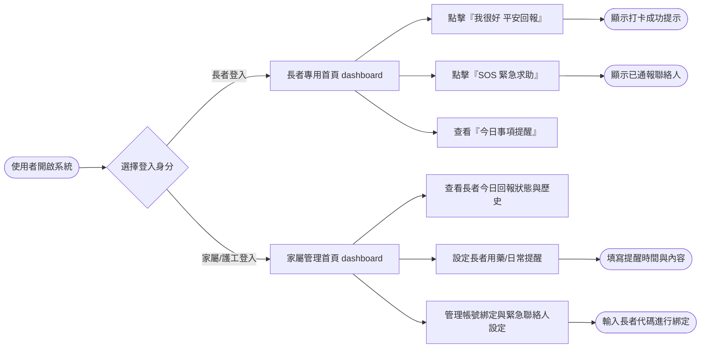
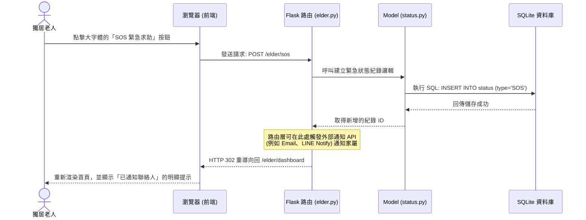

# 獨居老人生活管家 — 流程圖設計

> **對應文件**：[PRD](./PRD.md) / [Architecture](./ARCHITECTURE.md)  
> **版本**：v1.0  
> **最後更新**：2026-05-19

---

## 1. 使用者流程圖（User Flow）

### 1.1 整體系統流程

### 1.2 長者操作流程

### 1.3 家屬操作流程

---

## 2. 系統序列圖（Sequence Diagram）

### 2.1 使用者註冊流程

### 2.2 使用者登入流程

### 2.3 每日回報流程

### 2.4 緊急按鈕流程

### 2.5 新增事項提醒流程

---

## 3. 功能清單對照表

| 功能 | URL 路徑 | HTTP 方法 | 對應模板 | 說明 |
| :--- | :--- | :--- | :--- | :--- |
| 首頁 | `/` | GET | `index.html` | 系統介紹與登入入口 |
| 登入頁 | `/auth/login` | GET | `auth/login.html` | 顯示登入表單 |
| 登入處理 | `/auth/login` | POST | — | 驗證帳密，設定 session |
| 註冊頁 | `/auth/register` | GET | `auth/register.html` | 顯示註冊表單 |
| 註冊處理 | `/auth/register` | POST | — | 建立帳號，重導向登入頁 |
| 登出 | `/auth/logout` | GET | — | 清除 session，重導向首頁 |
| 長者主頁 | `/elder/dashboard` | GET | `elder/dashboard.html` | 顯示大按鈕介面 |
| 每日回報 | `/elder/daily-report` | POST | — | 記錄今日回報 |
| 緊急求助 | `/elder/emergency` | POST | — | 產生緊急通報 |
| 長者查看提醒 | `/elder/reminders` | GET | `elder/reminders.html` | 顯示今日提醒 |
| 標記提醒完成 | `/elder/reminders/<id>/complete` | POST | — | 更新提醒狀態 |
| 家屬儀表板 | `/family/dashboard` | GET | `family/dashboard.html` | 顯示長者狀態總覽 |
| 提醒列表 | `/family/reminders` | GET | `family/reminders.html` | 管理所有提醒 |
| 新增提醒頁 | `/family/reminders/new` | GET | `family/reminder_form.html` | 顯示新增表單 |
| 建立提醒 | `/family/reminders` | POST | — | 儲存新提醒 |
| 編輯提醒頁 | `/family/reminders/<id>/edit` | GET | `family/reminder_form.html` | 顯示編輯表單 |
| 更新提醒 | `/family/reminders/<id>/update` | POST | — | 更新提醒內容 |
| 刪除提醒 | `/family/reminders/<id>/delete` | POST | — | 刪除提醒 |
| 查看回報紀錄 | `/family/reports` | GET | `family/reports.html` | 查看長者回報歷史 |
| 查看緊急通報 | `/family/emergencies` | GET | `family/emergencies.html` | 查看緊急通報歷史 |

---

*下一步：請執行 DB Design Skill 產出資料庫設計文件。*
# 流程圖設計 (Flowchart)：獨居老人生活管家系統

本文件基於 PRD 與系統架構設計，視覺化了使用者的操作路徑與系統內部的資料流動。

## 1. 使用者流程圖 (User Flow)

展示兩種主要目標用戶（長者、家屬/護工）在系統中的核心操作路徑：

---

## 2. 系統序列圖 (Sequence Diagram)

以系統最核心的**「長者點擊 SOS 緊急求助」**功能為例，展示從使用者點擊到資料庫儲存的完整流程：

---

## 3. 功能清單與路由對照表

以下整理了系統主要功能、對應負責的角色、預計的 URL 路徑及 HTTP 方法：

| 功能名稱 | 目標角色 | URL 路徑 | HTTP 方法 | 說明 |
| --- | --- | --- | --- | --- |
| **註冊與登入** | 共用 | `/auth/login`   `/auth/register` | GET, POST | 處理帳號認證，登入後根據角色導向不同首頁 |
| **長者首頁** | 長者 | `/elder/dashboard` | GET | 渲染極簡大字體介面，顯示提醒事項與操作按鈕 |
| **平安回報** | 長者 | `/elder/checkin` | POST | 接收長者的平安打卡，紀錄時間與狀態 |
| **緊急求助 (SOS)** | 長者 | `/elder/sos` | POST | 接收緊急求助訊號，寫入資料庫並可觸發通知 |
| **家屬首頁** | 家屬/護工 | `/family/dashboard` | GET | 顯示已綁定長者的回報狀態總覽與歷史紀錄 |
| **設定提醒** | 家屬/護工 | `/family/reminders` | GET, POST | 列出、新增、編輯或刪除給長者的作息與用藥提醒 |
| **綁定長者** | 家屬/護工 | `/family/bind` | GET, POST | 設定緊急聯絡資訊與建立家屬、長者間的關聯 |
