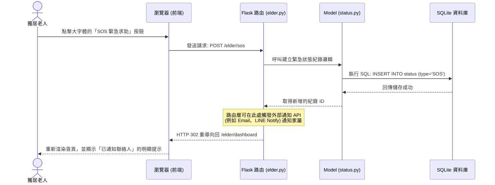

# 流程圖設計 (Flowchart)：獨居老人生活管家系統

本文件基於 PRD 與系統架構設計，視覺化了使用者的操作路徑與系統內部的資料流動。

## 1. 使用者流程圖 (User Flow)

展示兩種主要目標用戶（長者、家屬/護工）在系統中的核心操作路徑：

---

## 2. 系統序列圖 (Sequence Diagram)

以系統最核心的**「長者點擊 SOS 緊急求助」**功能為例，展示從使用者點擊到資料庫儲存的完整流程：

---

## 3. 功能清單與路由對照表

以下整理了系統主要功能、對應負責的角色、預計的 URL 路徑及 HTTP 方法：

| 功能名稱 | 目標角色 | URL 路徑 | HTTP 方法 | 說明 |
| --- | --- | --- | --- | --- |
| **註冊與登入** | 共用 | `/auth/login`   `/auth/register` | GET, POST | 處理帳號認證，登入後根據角色導向不同首頁 |
| **長者首頁** | 長者 | `/elder/dashboard` | GET | 渲染極簡大字體介面，顯示提醒事項與操作按鈕 |
| **平安回報** | 長者 | `/elder/checkin` | POST | 接收長者的平安打卡，紀錄時間與狀態 |
| **緊急求助 (SOS)** | 長者 | `/elder/sos` | POST | 接收緊急求助訊號，寫入資料庫並可觸發通知 |
| **家屬首頁** | 家屬/護工 | `/family/dashboard` | GET | 顯示已綁定長者的回報狀態總覽與歷史紀錄 |
| **設定提醒** | 家屬/護工 | `/family/reminders` | GET, POST | 列出、新增、編輯或刪除給長者的作息與用藥提醒 |
| **綁定長者** | 家屬/護工 | `/family/bind` | GET, POST | 設定緊急聯絡資訊與建立家屬、長者間的關聯 |
